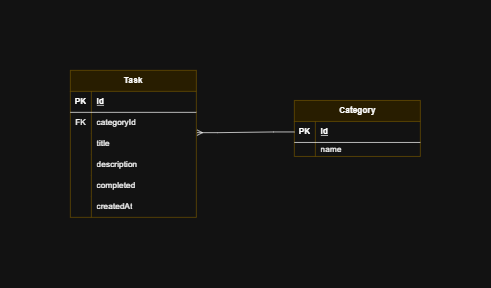

# To-Do List Project

This is a To-Do List application where you can create, view, update, and delete tasks. It allows you to mark tasks as completed, categorize tasks, and keep track of your tasks efficiently.

## Features

- **Create Task**: Add new tasks to the to-do list.
- **View Task Details**: View the details of each task.
- **Delete Task**: Remove tasks from the list.
- **View All Tasks**: View all the tasks that have been created.
- **Mark Task as Completed**: Mark tasks as completed to keep track of progress.
- **Categorize Tasks**: Assign a category to each task (e.g., Work, Personal, Urgent, etc.) to better organize them.

## Prerequisites

- Node.js (v14.x or higher)
- MySQL (used for database)
- Prisma ORM (for database management)

## Getting Started

To run this project locally, follow the steps below:

1. **Clone the repository**

   ```bash
   git clone <repository_url>
   cd <project_folder>
   ```

2. **Install dependencies**

   Make sure you have Node.js installed. Then, run:

   ```bash
   npm install
   ```

3. **Set up the database**

   You will need to have MySQL installed and running. Once the database is set up, configure the `.env` file with your MySQL connection details.

4. **Migrate the database**

   After cloning the project, run the Prisma migration to set up the database schema:

   ```bash
   npx prisma migrate deploy
   ```

   This will apply the necessary database migrations to your MySQL database.

5. **Build the project**

   Before starting the server, build the project:

   ```bash
   npm run build
   ```

6. **Start the development server**

   Now, start the server:

   ```bash
   npm start
   ```

   Your application should now be running locally.

## Deployment
You can access the live version of this application hosted on Vercel:

[Vercel - Live Demo](todolist-wx4i-3vhajefmx-ana-lauras-projects-5abe31d7.vercel.app)

## Database Schema




## Contributing

Feel free to fork the repository, create a branch, and submit pull requests for any improvements or bug fixes.

## License

This project is licensed under the MIT License - see the [LICENSE](LICENSE) file for details.
